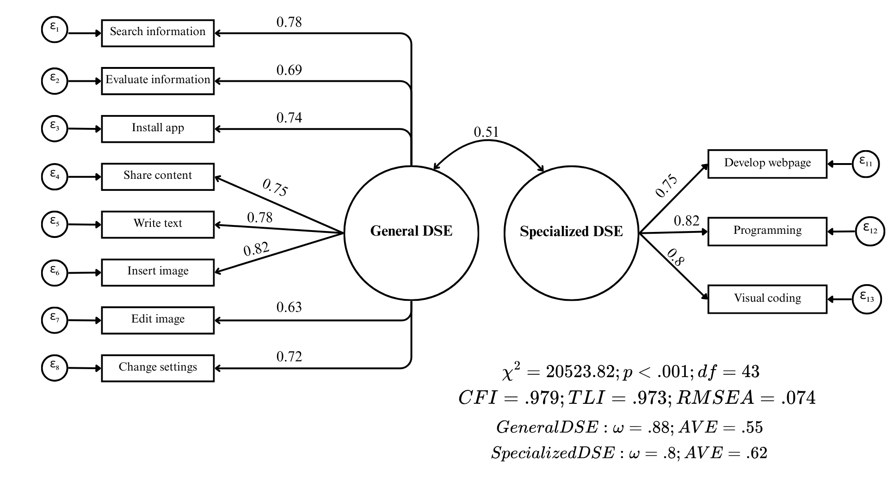
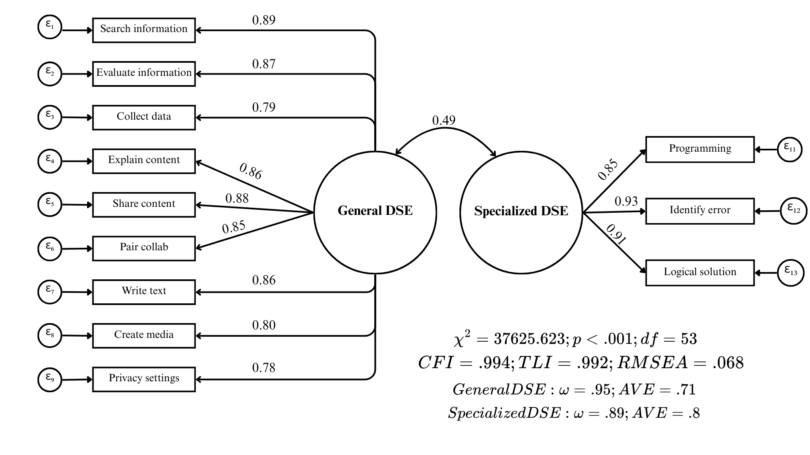

# Results

The results are organized into three sequential sections. The first section reports the assessment of the global measurement model and the subsequent invariance testing for the ICILS dataset. The second section presents the equivalent analysis for the PISA dataset, including model specification, fit, and invariance results. Finally, the third section provides the descriptive findings for both studies, focusing on the distribution of scores and gender disparities across the participating education systems.

## Study 1: ICILS

### Global Measurement Model Assessment

The initial model for ICILS exhibited a sub-optimal fit to the data, with an RMSEA exceeding the acceptable threshold of .08 ($RMSEA = .088$). Consequently, we conducted a principled respecification process, removing two items characterized by strong cross-loadings and multiple significant residual correlations. The first problematic item was 'Find the original sources of information referred to in an article on the internet,' which displayed a substantial modification index ($MI = 13,668.28$) driven by a cross-loading on the Specialized DSE factor. Additionally, this item showed strong positive residual correlations with technical indicators such as 'Programming' and 'Visual coding.' We proceeded to remove this item from the General DSE factor; the empirical overlap suggests that students may perceive the verification of digital sources as a complex, technical competency comparable to coding, rather than a generic information-seeking task. Subsequently, although the item 'Build or edit a webpage' showed a high modification index ($MI = 4,707.52$) due to a cross-loading on the General factor, it was retained to satisfy the constraint requiring a minimum of three indicators per factor. Instead, we removed the item 'Create a multi-media presentation (with sound, pictures, or video),' which exhibited a notable modification index ($MI = 3,982.96$) and strong positive residual correlations with 'Develop webpage.' The high covariance indicates that students perceive multimedia creation and web development as a unified dimension of 'content creation,' a finding that aligns with the DigComp framework ('3.1 Develop Digital Content'). A detailed table presenting all modification indices and residual correlations for the ICILS respecification process is provided in the Appendix (@tbl-mod-indices-icils and @tbl-residuals-icils).

{#fig-1}

Following the respecification, the final ICILS measurement model yielded fit indices indicative of a good fit to the data ($\chi^2 = 20,523.816$; $df=43$; $p < .001$; $CFI = .979$; $TLI = .973$; $RMSEA = .074$). Standardized factor loadings were substantial and statistically significant for all indicators, ranging from .63 to .82. This implies that the latent factors account for between 39.5% and 67.6% of the variance in the observed items ($R^2$). Regarding psychometric quality, both dimensions exhibited adequate internal consistency and convergent validity, with statistics surpassing the recommended cutoffs (General DSE: $\omega = .88$, $AVE = .55$; Specialized DSE: $\omega = .80$, $AVE = .62$). Finally, the estimation revealed a moderate correlation of .51 between the two factors, reinforcing the discriminant validity of the construct.

### Measurement Invariance Testing

```{r}
#| label: tbl-invariance-icils
#| tbl-cap: "Country and gender measurement invariance ICILS"
library(here)
library(flextable)
library(officer)
invariance_icils <- readRDS(here("output", "article", "tables", "invariance_table_icils.rds"))
invariance_icils
```

As presented in @tbl-invariance-icils, the ICILS measurement model achieved configural and metric invariance across participating countries. However, scalar invariance could not be established, as the decrease in $CFI$ ($\Delta CFI = -.007$) exceeded the strict cutoff criterion. While establishing metric invariance confirms that the factor loadings are comparable across educational systems, the lack of scalar invariance indicates non-equivalence in item intercepts, suggesting that students from different cultural backgrounds may interpret the items differently. Consequently, comparative analyses of latent means across countries were not conducted for the ICILS dataset. In contrast, the assessment of gender invariance yielded positive results; the model satisfied all three levels of invariance (configural, metric, and scalar), with changes in fit indices remaining well within acceptable ranges. Detailed information regarding factor loadings for the General and Specialized DSE dimensions, along with the $\chi^2$ contribution by country derived from the scalar invariance model, is provided in the Appendix (@tbl-loadings-chi-icils) to examine potential sources of misfit across countries.

## Study 2: PISA

### Model Respecification and Global Fit

The initial PISA model exhibited substantial misfit ($RMSEA = .12$), primarily driven by two items that displayed strong cross-loadings and multiple significant residual covariances. The first item, "Select the most efficient programme or App that allows me to carry out a specific task", showed a substantial modification index for the General factor ($MI = 76,502.42$) and problematic negative residual correlations with items from the Specialized dimension (e.g., "logical solution", "programming"). Additionally, it showed a positive residual correlation with "Change settings", an indicator of the General DSE factor. Consequently, this item was removed; contrary to the theoretical model, the data suggest this task is perceived by students as a general competency rather than one related to the technical problem-solving nature of the specialized dimension.

The second problematic item was 'Create, update and maintain a webpage or a blog,' which also presented a strong cross-loading on the General factor ($MI = 39,013.99$). Crucially, it exhibited its strongest positive residual correlation with 'Create media.' This specific covariance mirrors the pattern observed in the ICILS respecification, indicating that students perceive web page development and multimedia creation as a unified dimension of 'content creation,' a finding aligned with the DigComp framework. Theoretically, this shift is likely driven by the democratization of web development through user-friendly platforms (e.g., Wix, Fandom), which has moved the task away from specialized technical coding. Furthermore, unlike ICILS, the PISA item phrasing explicitly references a 'blog,' which further anchors the task in non-technical content creation contexts. Based on these consistent empirical and theoretical grounds across both studies, this item was removed from the PISA analysis. In the appendix, a comprehensive table details the modification indices and residual correlations that informed the PISA model respecification process (@tbl-mod-indices-pisa and @tbl-residuals-pisa).

{#fig-2}

Following this respecification, the PISA model demonstrated a satisfactory fit to the data ($\chi^2 = 37,625.623$; $df=53$; $p < .001$; $CFI = .994$; $TLI = .992$; $RMSEA = .068$). Factor loadings were high and statistically significant, ranging from .78 to .93, thus explaining between 60% and 86% of the item variance ($R^2$). Additionally, both factors demonstrated strong reliability and convergent validity, exceeding all established thresholds (General DSE: $\omega = .95$, $AVE = .71$; Specialized DSE: $\omega = .89$, $AVE = .80$). The inter-factor correlation was moderate at .49, further supporting the distinctness of the dimensions.

### Measurement Invariance Testing

```{r}
#| label: tbl-invariance-pisa
#| tbl-cap: "Country and gender measurement invariance PISA"
#| 
invariance_pisa <- readRDS(here("output", "article", "tables", "invariance_table_pisa.rds"))
invariance_pisa
```

As detailed in @tbl-invariance-pisa, the PISA measurement model successfully established invariance across all three tested levels (configural, metric, and scalar) for both country and gender groupings. The changes in the key fit indices ($\Delta CFI$ and $\Delta RMSEA$) between the nested models remained strictly within the recommended thresholds. These results confirm the cross-cultural and cross-gender comparability of the DSE construct within the PISA dataset, thereby satisfying the necessary psychometric prerequisites for comparative analyses. Consistent with the reporting for ICILS, a detailed table presenting the factor loadings and country-specific $\chi^2$ contributions derived from the scalar invariance model is provided in the Appendix (@tbl-loadings-chi-pisa).

## Country and Gender Differences in DSE

This section presents the descriptive analyses by country and gender for both the PISA and ICILS datasets. To ensure that the results accurately reflect the underlying population structures, all descriptive statistics were calculated applying the final sampling weights for each study (Senate Weights). A methodological distinction regarding comparability is necessary: while PISA established scalar invariance (allowing for strict mean comparisons), ICILS only achieved metric invariance. Consequently, the absolute ranking of countries in ICILS should be interpreted with caution and regarded as exploratory. However, we opted to utilize averaged indices for both studies to maintain analytical consistency. A robustness check conducted for both datasets confirmed that the averaged indices and latent mean scores correlated above .95 across all participating countries (see @tbl-index-latent-means-pisa and @tbl-index-latent-means-icils in the Appendix). Furthermore, employing averaged indices preserves the original response scale, facilitating the substantive interpretation and enabling a direct comparison between the General and Specialized dimensions across both datasets.

{#fig-3} 

{#fig-4}

As illustrated in @fig-3 (PISA) and @fig-4 (ICILS), a highly consistent pattern emerges across all participating education systems in both studies: students systematically report higher levels of General DSE compared to Specialized DSE. Regarding the country-level distribution for the Specialized dimension, the results from both assessments reveal a striking counter-intuitive finding. Education systems often characterized by developing digital infrastructure relative to the OECD average report the highest aggregate specialized self-efficacy; this is evident in the prominent position of Kazakhstan in PISA, and both Kazakhstan and Romania in ICILS. In sharp contrast, countries with advanced digital ecosystems and traditionally strong performance on Computer and Information Literacy (CIL) assessments—such as Germany, Austria, and Denmark—rank at the very bottom of the distribution in both studies. This inversion suggests that reported self-efficacy in specialized tasks may not linearly correspond to the objective technological development of the country.

{#fig-5} 

{#fig-6}

Consistent with prior literature [@gebhardt_gender_2019], the analysis reveals distinct gender patterns across the two dimensions of digital self-efficacy, replicated in both assessments. As illustrated in @fig-5 and @fig-6, female students generally report higher levels of self-efficacy in the General dimension; however, these differences are relatively modest in magnitude. In sharp contrast, the Specialized dimension reveals a pronounced and consistent gap favoring male students across almost all participating education systems. Notable exceptions to this trend are observed in countries like Kazakhstan and Chile, where the gender gap in the specialized dimension is minimal or non-existent. An examination of the country-specific magnitudes reveals a counter-intuitive pattern regarding the relationship between national development contexts and these disparities. Education systems traditionally associated with higher levels of gender equality and digital development, such as Germany, Denmark, and Finland, exhibit considerably larger gender gaps in specialized self-efficacy compared to the aforementioned developing contexts.