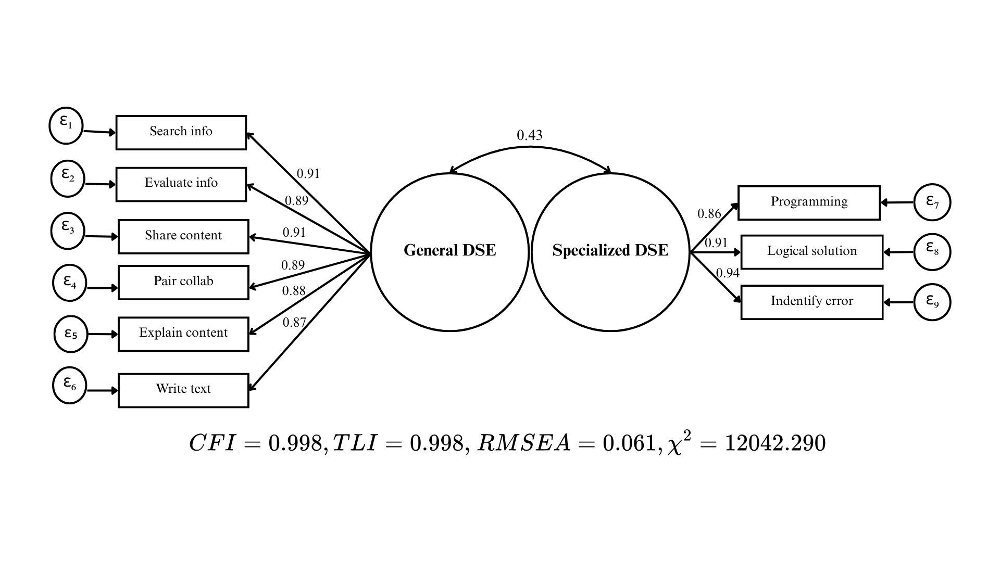

## Pooled models

**Cambiar: Los mi cambiaron por utilizar pairwise en vez de listwise**

Los modelos hipotetizados originalmente para ambos estudios no ajustaron inicialmente, por lo que necesitaron algunas modificaciones para ajustar según los criterios establecidos. Con respecto a PISA, el modelo pooled obtuvo los siguientes indicadores de ajuste: CFI = 0.98; TLI = 0.98; RMSEA = 0.16, traspasando el umbral máximo de RMSEA aceptable de 0.08. Dado este resultado, se realizó un proceso de re especificación del modelo, eliminando variables del mismo. La primera variable que se sustrajo del modelo fue 'identify app', la cual según los indices de modificación es medida por la subdimensión general de la variable latente (MI = 97,163). Esta variable, a diferencia de las demás de la subdimensión especializada, no refiere a tareas relacionadas específicamente con la programación, por lo cual podría no estar ajustando bien dentro del factor. La siguiente variable que se eliminó del modelo fue 'develop webpage', debido a que es medida por la DSE general (mi=49,218). Es posibile que debido a la propagación y popularización de plataformas para crear páginas web de forma 'user friendly' esta habilidad ha dejado de ser considerada tan compleja por los jóvenes. La siguiente variable que fue removida del modelo fue 'change settings', debido a ser medida por DSE especializada. Esta variable no tiene una relación directa con las dimensiones básicas de 'digital literacy' reconocidas en el marco DigComp (informativas, comunicacionales y creativas), sino con la dimensión relacionada a la privacidad. Luego, la variable 'collect data' es sustraída, ya que los índices de modificación señalan que es medida por la DSE especializada (MI=9,781). Si bien es un ítem que requiere un análisis más profundo, las habilidades de recolección y análisis de datos básicas que consulta parecen ser percibidas como más complejas por los estudiantes. Por último, la variable 'create media' fue extraída del modelo, ya que los índices de modificación apuntan a que es medida por la subdimensión especializada (mi=7,858). Aunque no contamos con evidencia sustantiva para afirmar esto, es plausible que el umbral percibido para ser proficiente en las habilidades multimedia haya aumentado para los estudiantes, debido a la alta disponibilidad de contenido multimedia de muy buena calidad en internet.

Sobre ICILS, el modelo pooled tampoco ajustó debido a un RMSEA muy alto; sus indicadores de ajuste son: CFI = 0.97; TLI = 0.96; RMSEA = 0.11. Nuevamente, se siguió un proceso de re especificación del modelo hipotetizado. Primero, 'source info' fue eliminada del modelo, ya que es medida por DSE especializada (mi=16.787). Identificar una fuente de información el día de hoy se ha vuelto muy complejo, dar con el origen de un dato concreto es algo que requiere mayor especialización. Tanto es así, que esta variable muestra una alta varianza compartida con visual coding y programming. Luego, al igual que en el estudio anterior, se elimina change settings, debido a no estar relacionada con las dimensiones básicas del marco DigComp. Por último, dos variables relacionadas a habilidades multimedia fueron eliminadas debido a ser medidas por la DSE especializada, 'create media' (mi=5.831) y 'edit image' (mi=6.034). Que en ambos estudios estas variables se inclinen por el factor de autoeficacia especializada nos inclina a pensar que más que un problema de medición específico de un estudio realmente está cambiando la dificultad percibida por los estudiantes de las habilidades de edición y manejo de audio, video e imágenes.

Dado lo anterior, se proponen los siguientes modelos reespecificados de DSE bidimensional para ambos estudios.

## Modified-Fitted models

**Cambiar: los loadings y indicadores de ajuste cambiaron por usar pairwise. Modificar diagramas**

En el caso de PISA, el factor general queda con seis variables y el especializado con tres. Los índicadores de ajuste están dentro del rango de ajuste excelente (\>0.95) en el caso de CFI y TLI y aceptable (\>0.08) en el caso del RMSEA. Todas las cargas factoriales son mayores a 0.85, por lo que los factores propuestos están explicando una buena porción de la varianza de los items que componen la variable latente (\>72%\~). La correlación entre los dos factores es moderada, de 0.43.

**Duda: ¿Agregar y reportar los grados de libertad?**

Con respecto a ICILS, el modelo tiene un ajuste algo más holgado que en PISA. Si bien el CFI y el TLI también indican un ajuste excelente, el RMSEA está justo en el límite para ser considerado aceptable. Sumado a esto, las cargas factoriales son algo menores, aunque siguen presentando una alta magnitud, con valores que oscilan entre 0.68 y 0.84, por lo que estarían explicando en el peor de los casos un 46.2% de la varianza de los ítems. La correlación entre ambos factores es casi exactamente igual a la del modelo de PISA, de 0.44.

## Multigroup CFA and invariance analysis

Luego de probado el ajuste de los modelos para cada estudio, se continuó con el análisis confirmatorio multigrupo y la invarianza. Partiendo con la invarianza entre países, en el estudio de PISA se pasaron los tres niveles que fueron testeados, el configural, el métrico y el escalar, mostrando un cambio menor a lo esperado en los indicadores de ajuste clave (CFI y RMSEA). Esto establece comparabilidad entre países y permite continuar con los análisis posteriores. Por el otro lado, ICILS superó el primer nivel más restrictivo (escalar), sin embargo no se puede afirmar inarianza escalar debido a una diferencia fuera de los rangos esperados en CFI (-0.007). Esto nos permite realizar comparaciones entre las cargas factoriales de los diferentes países pero no en los puntajes factoriales sin reparaciones, ya que pueden estar entendiendo la batería de manera distinta por el gran impacto en la medición del constructo al fijar los interceptos.

En el caso de la invarianza de género, ambos estudios pasaron los dos niveles de invarianza con cambios menores a los problemáticos entre los distintos modelos. Esto significa que las variables latentes son comparables entre géneros en ambos estudios, y permite realizar análisis comparativos con cargas y puntajes factoriales.

## Descriptives by gender and countries

Graphs for loadings by gender and countries (PISA and ICILS (if fitted and comparable))