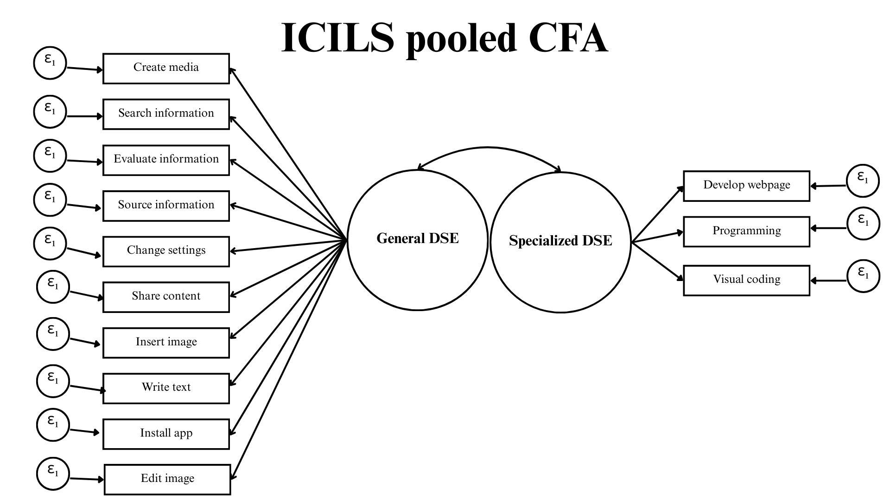
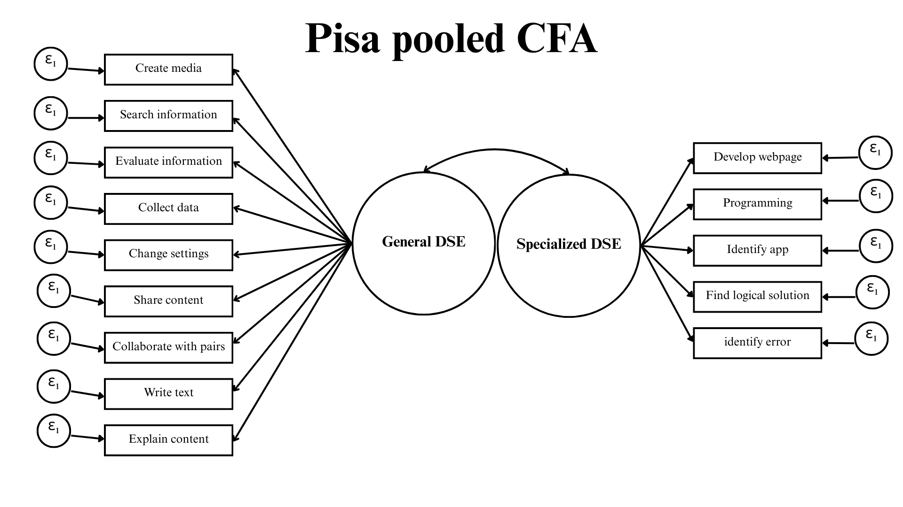

## Pooled model: PISA

It don't fit, so modifications are needed. (no es necesario mostrar el diagrama). Aquí explicar cada variable que se sace y su mi.

## Pooled model: ICILS

It don't fit, so modifications are needed.

## Modified-Fitted model: PISA

Here we propose and report the modified PISA model. Relevant indicators are cfi, rmsea and loadings. **Aquí mostrar los modelos propuestos (diagrama y luego con loadings y ajustes).**

Debo explicar qué items se eliminaron y por qué (cargas cruzadas, covarianzas, etc.)

Aquí poner los diagramas **con los puntajes, indicadores de ajuste.**

## Modified-Fitted model: ICILS

Here we propose and report the modified ICILS model. Relevant indicators are cfi, rmsea and loadings.

## Invariance analysys: PISA

Here we show and analyze the invariance table for country and gender for the PISA chosen and modified model.

## Invariance analysis: ICILS

Here we show and analyze the invariance table for country and gender for the PISA chosen and modified model.

## Descriptives by gender and countries

Graphs for loadings by gender and countries (PISA and ICILS (if fitted and comparable))

