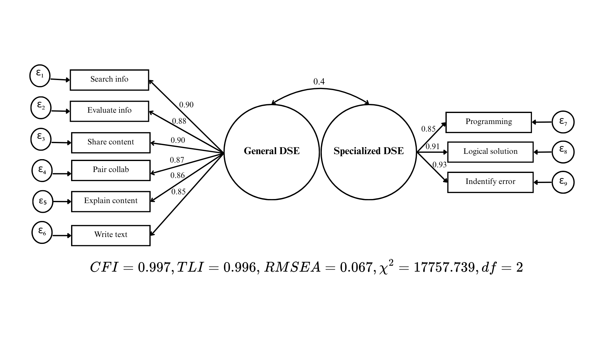
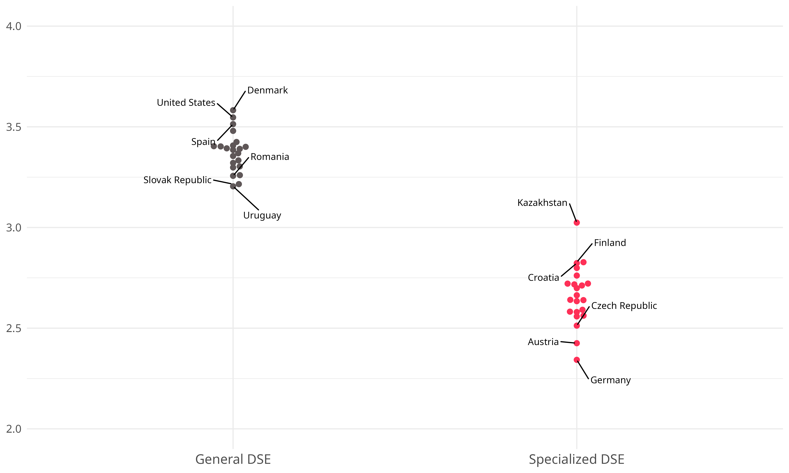
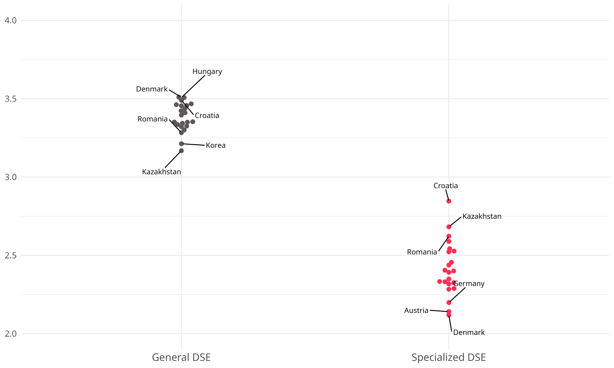
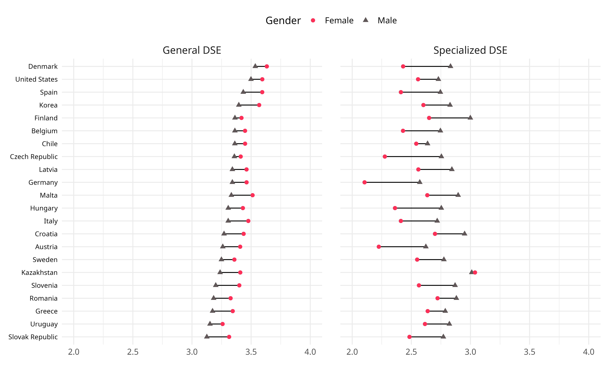
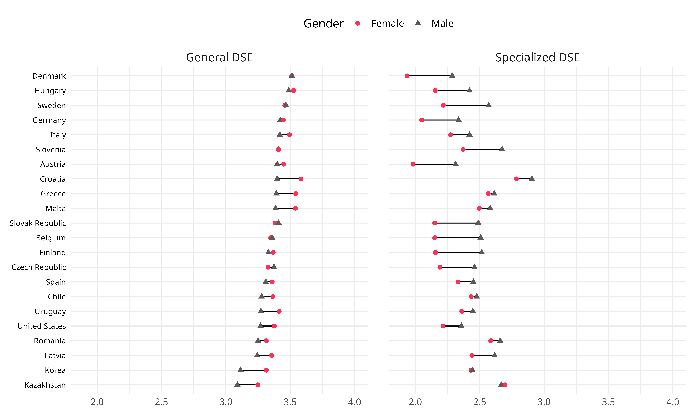

# Results

## Pooled models

The models originally hypothesized for both studies did not achieve an initial fit, thus requiring several modifications to meet the established criteria. Regarding PISA, the pooled model yielded the following fit indices: CFI = 0.98; TLI = 0.97; RMSEA = 0.15, exceeding the maximum acceptable RMSEA threshold of 0.08. Given this result, a model re-specification process was undertaken, removing items from the model. The first item dropped from the model was ‘identify app’, which, according to the modification indices, cross-loaded on the general sub-dimension of the latent variable (MI = 113,132). This item, unlike the others in the specialized sub-dimension, does not refer to tasks specifically related to programming, which may explain why it did not fit well within the factor. The next item removed was *develop webpage*, due to its cross-loading on the general DSE factor (MI = 61,606). It is possible that due to the propagation and popularization of 'user-friendly' platforms for website creation, this skill is no longer considered advanced by young people. The next item removed was *change settings*, due to it cross-loading on the specialized DSE factor (MI = 9,168). This item is not directly related with the most basic 'digital literacy' dimensions recognized in the DigComp framework (information, communication, and creation), but rather to the dimension related to privacy. Next, the *collect data* item was dropped, as modification indices indicated it cross-loaded on the specialized DSE factor (MI = 11,187). Although this item requires deeper analysis, the basic data collection and analysis skills it assesses seem to be perceived as more complex by students. Finally, the *create media* item was extracted from the model, as modification indices suggested it cross-loaded on the specialized sub-dimension (MI = 7,927). Although we lack substantive evidence to affirm this, it is plausible that the perceived threshold for proficiency in multimedia skills has increased for students, given the wide availability of high-quality multimedia content on the internet.

In the case of ICILS, the model also failed to fit due to a very high RMSEA; its fit indices were: CFI = 0.97; TLI = 0.96; RMSEA = 0.1. Again, a re-specification process of the hypothesized model was followed. First, *source info* was removed from the model, as it cross-loaded on the specialized DSE factor (MI = 18,633). Identifying an information source today has become very complex; tracing the origin of a specific piece of data is something that, in the students' view, apparently requires greater specialization. So much so, that this item shows high shared variance with visual coding and programming. Then, just as in the previous study, *change settings* was removed, due to it not being related to the basic dimensions of the DigComp framework. Finally, two items related to multimedia skills were removed due to cross-loading on the specialized DSE factor: *create media* (MI = 6,174) and *edit image* (MI = 6,510). The fact that in both studies these items lean towards the specialized self-efficacy factor leads us to think that, rather than a measurement issue specific to one study, the students' perceived difficulty of editing and managing audio, video, and image skills is genuinely changing.

Given the above, the following re-specified two-dimensional DSE models are proposed for both studies.

## Modified-Fitted models

*Figure 1: PISA fitted model*

*Figure 2: ICILS fitted model*

In both studies, the general factor remains with six items and the specialized factor with three. In PISA, the fit indices are within the excellent fit range (\>0.95) for CFI and TLI, and the acceptable range (\<0.08) for RMSEA. All factor loadings are greater than 0.85, indicating that the proposed factors explain a good portion of the variance of the items comprising the latent variable (at least 72.3%). The correlation between the two factors is moderate, at 0.4.

Regarding ICILS, the model shows a slightly looser fit than in PISA. Although the CFI and TLI also indicate an excellent fit, the RMSEA is just at the borderline to be considered acceptable. In addition to this, the factor loadings are somewhat lower, although they still show high magnitude, with values ranging from 0.68 to 0.84, meaning they would explain, in the worst-case scenario, 46.2% of the item variance. The correlation between both factors is very similar to the PISA model, at 0.43.

## Multigroup CFA and invariance analysis

Starting with cross-country invariance, the PISA study passed all three tested levels (configural, metric, and scalar), showing changes in the key fit indices ($\Delta$CFI and $\Delta$RMSEA) that were within acceptable ranges. This establishes cross-country comparability and permits subsequent analyses. On the other hand, while ICILS achieved configural and metric invariance, scalar invariance could not be established due to a change in CFI (-0.007) that exceeded the cut-off criterion. This allows us to compare the factor loadings across countries, but it does not permit the comparison of latent means, as groups may interpret the items differently (i.e., the intercepts are not equivalent).

Regarding gender invariance, both studies achieved scalar invariance. The changes between the nested models ($\Delta$CFI and $\Delta$RMSEA) were within the acceptable ranges (i.e., below the problematic cut-offs). The latent constructs are comparable across genders in both studies, permitting comparative analyses of both factor loadings and latent means.

## Descriptives by gender and country

This section reports descriptive analyses by country and gender for both dimensions in the two studies. We opted to use averaged indices rather than latent mean scores for DSE for two main reasons: (1) in both studies, the correlation between the summative index and the latent mean for each dimension (general and specialized) exceeded 0.95 in all countries; (2) using indices preserves the original scale of the items, facilitating interpretation of the descriptive results. Although ICILS failed to achieve scalar invariance across countries, we present its descriptive results with the caveat that intercept variability across countries limits comparability. In each database, indices were computed only for observations included in the pairwise model estimation to ensure consistent treatment of missing data.

*Figure 3: PISA country scores comparison*  

*Figure 4: ICILS country scores comparison* 

In both studies, general DSE scores higher than specialized DSE, as expected. The difference is somewhat larger in ICILS. The most striking finding concerns the distribution of countries in the specialized dimension, where countries with lower technological development report higher aggregate self-efficacy (e.g., Kazakhstan), while countries with better performance on the CIL test rank at the bottom of the distribution (e.g., Germany, Austria).

*Figure 5: PISA gender gaps by country* 

*Figure 6: ICILS gender gaps by country* 

Regarding gender gaps across different cultures, we observe similar patterns in both PISA and ICILS. Consistent with the literature, we expected girls to score higher on the general dimension and boys to score higher on the specialized dimension. In PISA, Figure 6 shows that girls consistently score higher on the general dimension, while boys demonstrate higher self-efficacy on the specialized dimension, with notably larger gaps. In ICILS (Figure 7), the gender gap on the general dimension is less consistent across countries, with some instances showing negligible differences. On the specialized dimension, boys again show substantially larger advantages. A counterintuitive finding from both studies concerns the relationship between countries' gender equality development and the magnitude of gender gaps favoring boys on specialized tasks: countries such as Germany, Denmark, and Finland exhibit considerably larger gaps on the specialized dimension than countries like Chile or Kazakhstan.