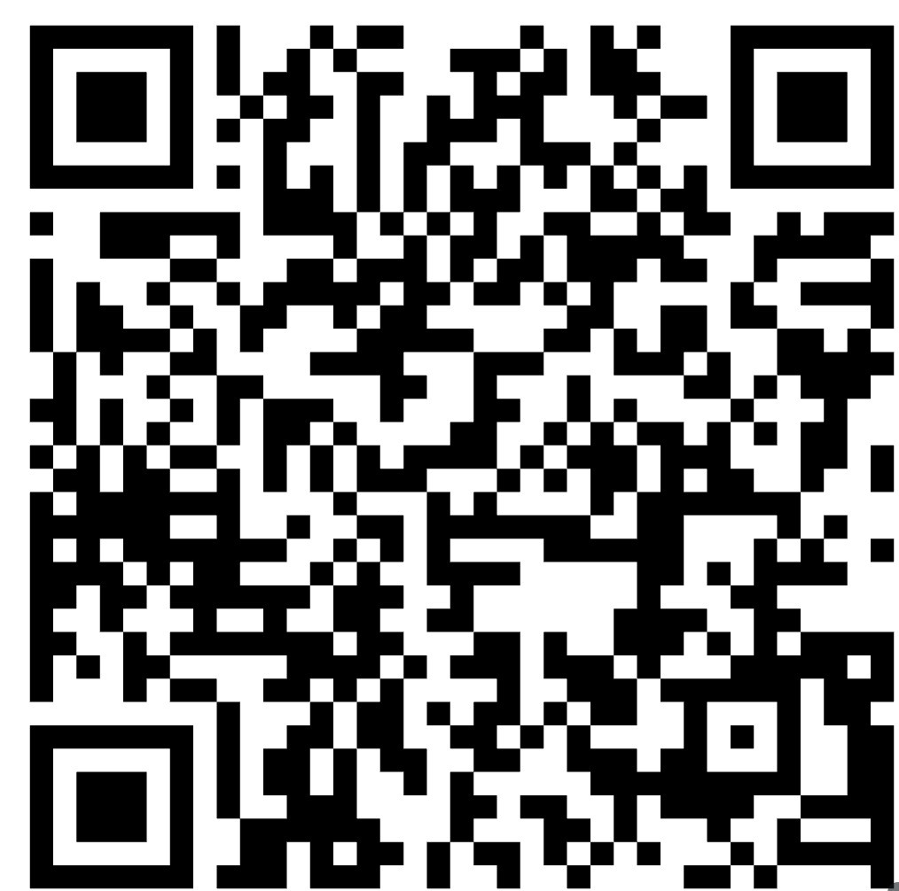
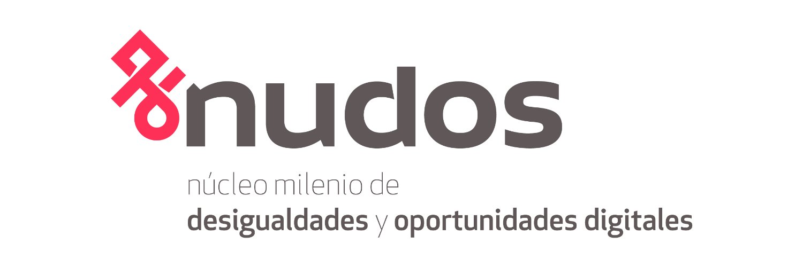
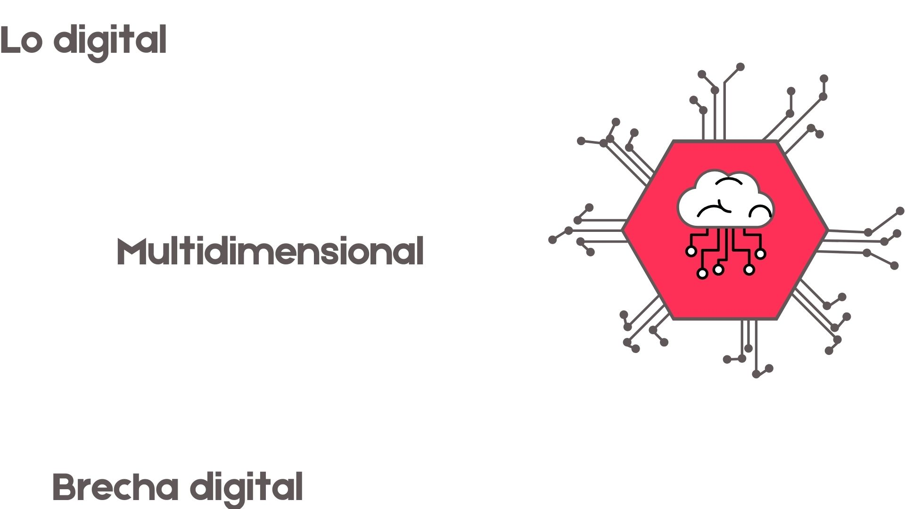
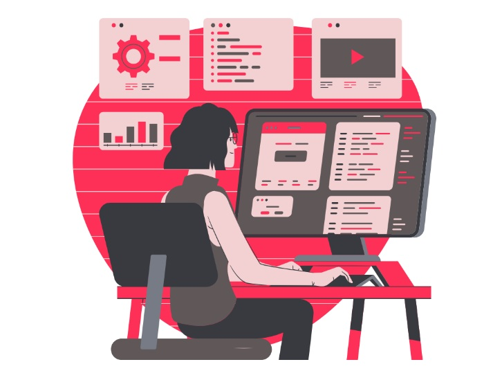
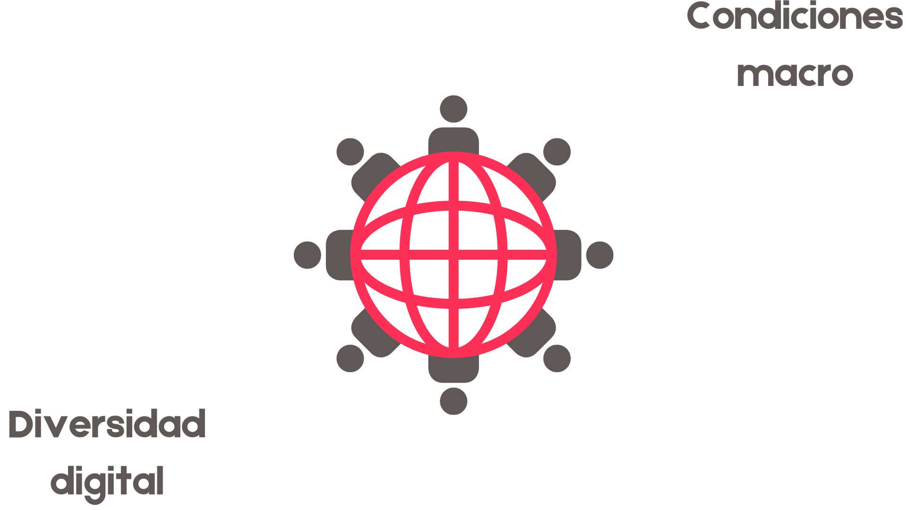
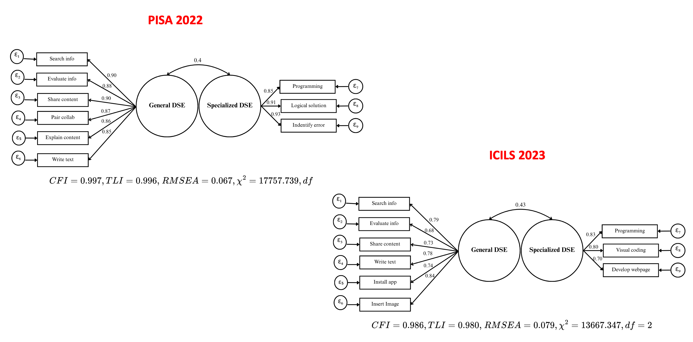
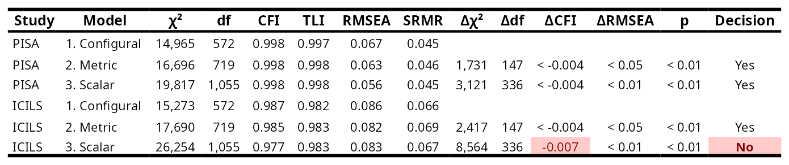
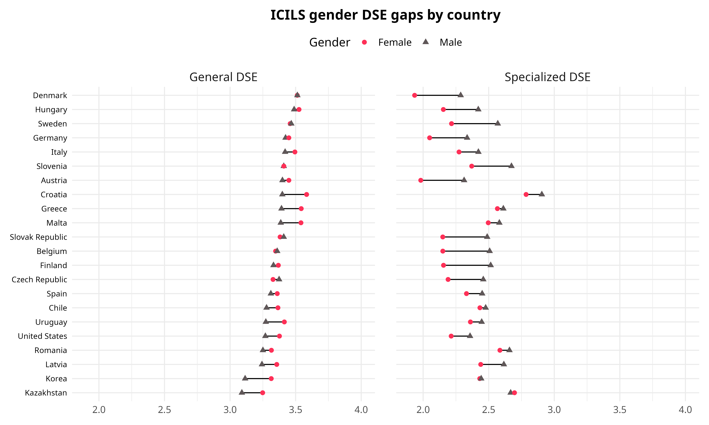
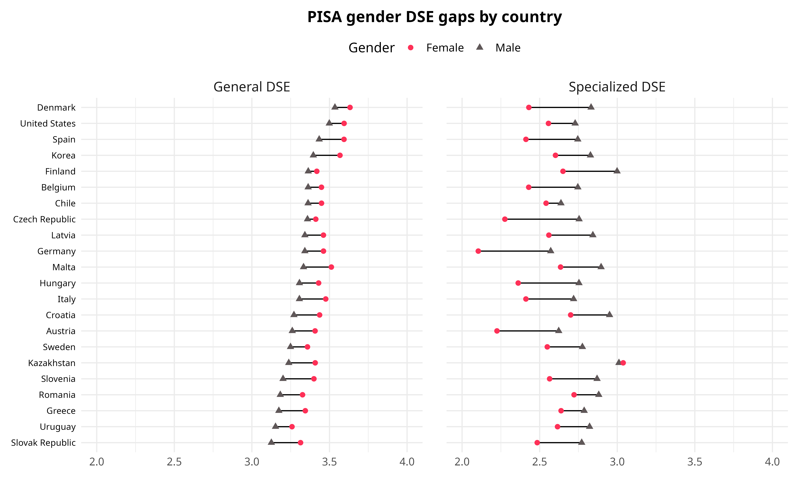

::: columns
::: {.column width="10%"}



:::

::: {.column .column-right width="85%"}
<br>

## **Medición de autoeficacia digital y diferencias de género en evaluaciones internacionales de gran escala**

------------------------------------------------------------------------

Daniel Miranda, Ismael Aguayo, Juan Carlos Castillo, Nicolas Tobar y Tomás Urzúa

#### Universidad de Chile y [Núcleo Milenio Desigualdades y Oportunidades Digitales](https://nudos.cl).

XI Congreso de la Sociedad Científica de Psicología; USS, 5-7 Noviembre, Valdivia
:::
:::

## NUDOS {.scrollable}

```{=html}
<iframe width="1000" height="500" src="https://www.nudos.cl/" title="Webpage example"></iframe>
```
[More information: nudos.cl](https://www.nudos.cl/)

{width="80%" fig-align="center"}


## Punto de partida



## Autoeficacia digital y género

::: columns
::: {.column width="50%" style="font-size: 40px;"}
"... *expectativas de las propias capacidades para aprender y realizar tareas con las tecnologías y ambientes digitales*" (Ulffert-Blank & Schmidt, 2022).

Importante factor para la competencia digital
:::

::: {.column width="50%"}
{width="100%"}
:::
:::

## ¿Bidimensionalidad de la autoeficacia digital?

::: {.incremental .highlight-last style="font-size: 35px;"}
-   Un concepto cambiante: Computacional -\> Internet -\> TIC -\> Digital (DigComp)

-   En los últimos años se ha propuesto una distinción entre dos tipos de autoeficacia: general y especializada, para distinguir tareas de programación y comunicacionales-informativos básicos.

-   Sin embargo, algunos estudios internacionales operacionalizan autoeficacia digital como un constructo unidimensional, otros como bidimensional.
:::

## ¿Estabilidad de la bidimensionalidad?



##  {data-background-color="#5f5758"}

::: {style="font-size: 180%; display: flex; justify-content: center; align-items: flex-start; flex-direction: column; text-align: center"}
*¿Es posible identificar dos dimensiones de autoeficacia digital en PISA e ICILS?*

*¿Es el modelo bidimensional de autoeficacia digital equivalente por género y entre países?*

*¿Cómo se distribuyen las diferencias de genero en autoeficacia digital entre países?*
:::

## Datos

::: columns
::: {.column width="50%" style="font-size: 40px;"}
-   Programa por la Evaluación Internacional 2022 (n≈183.000).

-   Estudio por la Alfabetización Computacional y de la Información 2023 (n≈90.000).

-   22 países compartidos.
:::

::: {.column width="50%"}
{width="70%"} {width="50%"}
:::
:::

## Baterías de Autoeficacia digital

PISA: ¿En qué medida eres capaz de **realizar las siguientes tareas** cuando utilizas herramientas digitales?

ICILS: ¿Qué tan bien puedes hacer...?

::: columns
::: {.column width="50%" style="font-size: 30px;"}
**Autoeficacia general**

PISA: 8 ítems, ICILS: 10 ítems

-   Buscar y evaluar información en internet.

-   Compartir contenido en línea

-   Escribir o editar textos.

-   Crear o editar imágenes.
:::

::: {.column width="50%" style="font-size: 30px; color: #ff3057;"}
**Autoeficacia especializada**

PISA: 6 ítems, ICILS: 3 ítems

-   Desarrollo de páginas web.

-   Programación.

-   Pensamiento lógico-computacional
:::
:::

# Métodos {data-background-color="#5f5758"}

-   Validación métrica de la escala (AFC) y re especificación de los modelos.

-   Estabilidad de la escala entre páises y por género (AFC multigrupo).

-   Exploración de distribuciones y diferencias de género.

# Resultados {data-background-color="#5f5758"}

1.  Modelo de Medición
2.  Prueba de invarianza
3.  Distribución de medias entre países
4.  Diferencias de género entre países

## Modelo original: pooled

#### PISA 2022

CFI = 0.98; TLI = 0.97; RMSEA = 0.15, exceeding the maximum acceptable RMSEA threshold of 0.08

#### ICILS 2023

CFI = 0.97; TLI = 0.96; RMSEA = 0.10, exceeding the maximum acceptable RMSEA threshold of 0.08

## Modelo Ajustado: pooled



## AFC e Invarianza

#### Entre países



#### Por género


## 

{width="100%"}

## 

{width="100%"}

## 

{width="100%"}

## 

{width="100%"}

## Conclusiones

::: {.incremental .highlight-last style="font-size: 100%;"}
-   ¿Es posible identificar dos dimensiones en PISA e ICILS?

    -   Sí, pero con menos ítems de los que proponen ambos estudios.

-   ¿Es el modelo bidimensional de autoeficacia digital equivalente por género y entre países?

    -   En PISA sí, en ICILS solo a nivel métrico.

-   ¿Qué diferencias de género existen en la autoeficacia digital entre países?

    -   Las mujeres toman ventaja en autoeficacia general y los hombres en especializada.
:::

## Discusión

::: {.highlight-last style="font-size: 40px;"}
-   La evolución de las mediciones: ICTSE vs. DSE y el marco DigComp

-   ¿Son dos o más dimensiones?

-   La contraintuitiva relación entre el desarrollo de los países y la brecha de género
:::

## Siguientes pasos {style="font-size: 60px;"}

¿Qué factores a nivel macro pueden explicar las diferencias en autoeficacia digital y las brechas de género?

¿Qué está pasando en los países desarrollados/no desarrollados?

# Gracias!

-   **Sitio web NUDOS:** [www.nudos.cl](https://www.nudos.cl/)
-   **Repositorio Github del proyecto:** <https://github.com/milenio-nudos/picils_dse>

# Anexo

## Items eliminados

-   Manipulación multimedia
-   Búsqueda de fuentes de información
-   Configuración de privacidad
-   Selección de apps.
