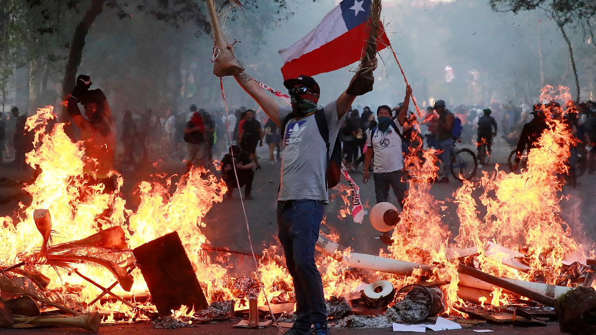
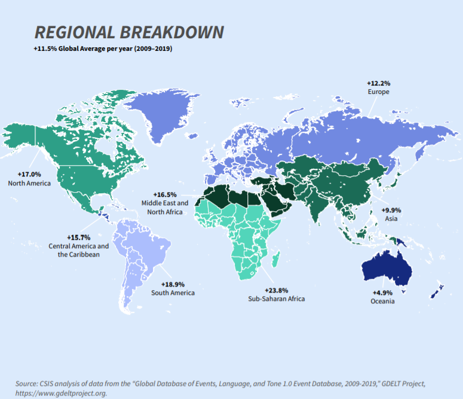
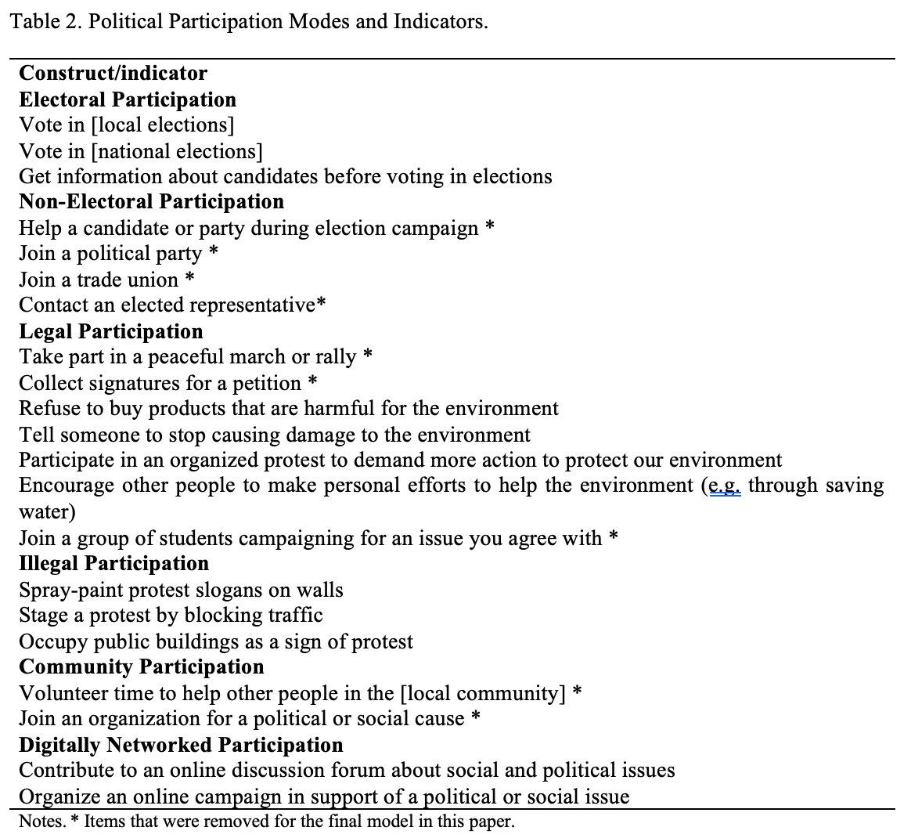
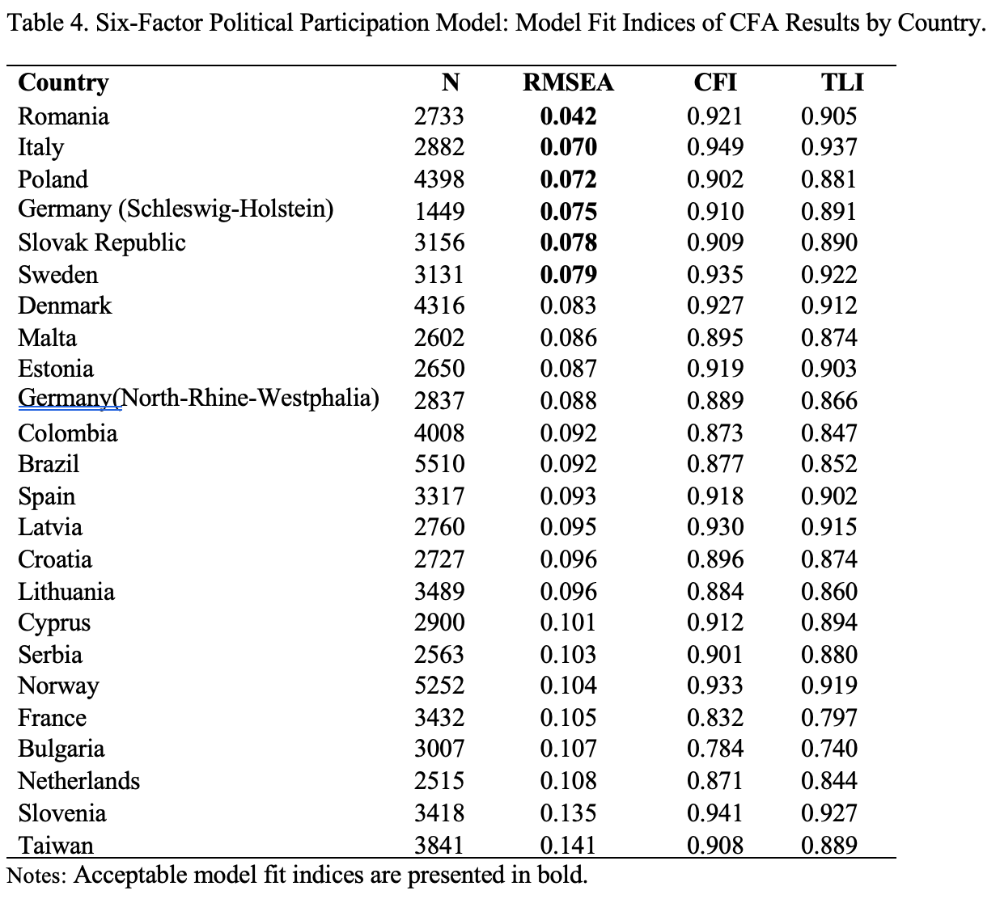
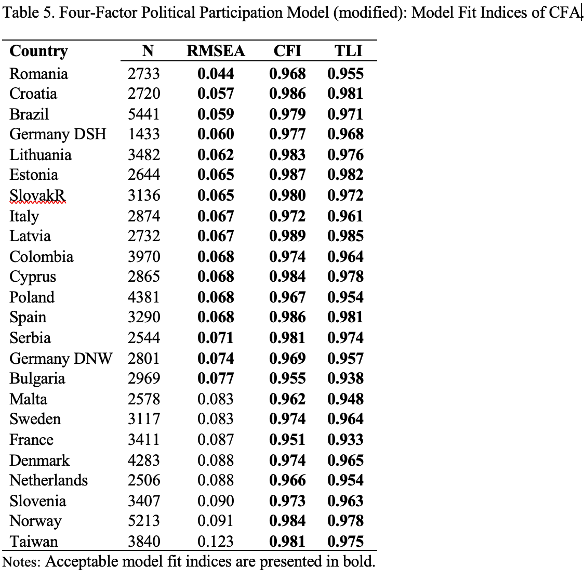
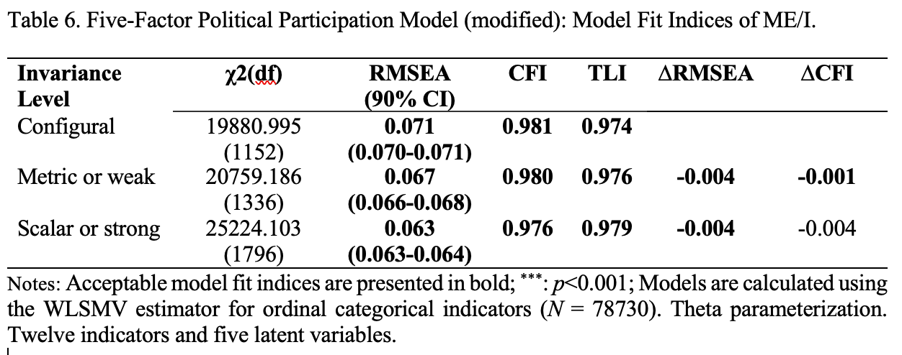
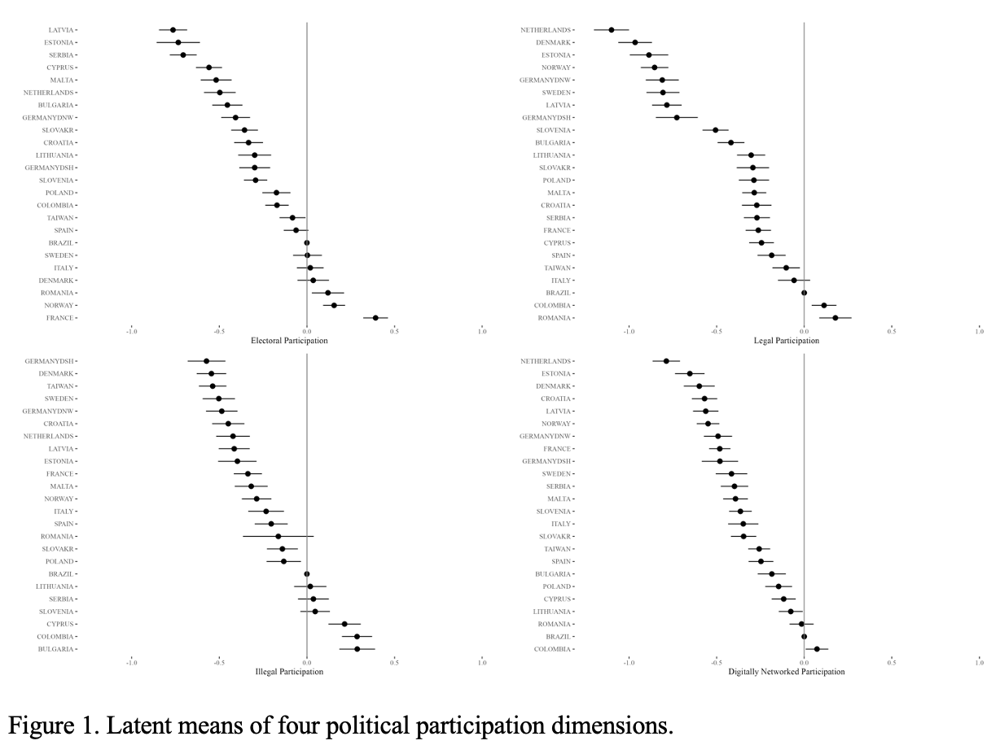

::: columns
::: {.column width="10%"}


:::

::: {.column .column-right width="85%"}
<br>

### **Participación política juvenil: medición transnacional y patrones en el ICCS 2022**

------------------------------------------------------------------------

**Daniel Miranda**, Departmento de Psicología, Universidad de Chile

**María Magdalena Isac, Linde Stals, Emilie Vandevelde**, KU Leuven

**Jorge Matamala**, Universidad del Desarrollo

*Trabajo desarrollado en el marco del proyecto FONDECYT regular n°1240922*

**Segundo Congreso Internacional de la Asociación Chilena de Metodología, Medición y Evaluación -- 2026"**

La Serena, Chile, 7 - 8 - 9 de enero 2026
:::
:::

## ¿Qué es la participación política?

```{r echo=FALSE, out.width = '80%', fig.retina = 1, fig.align='center'}
# this is a slide displaying an image only
knitr::include_graphics('./files/participa.png')
```

## ¿Qué es la participación política?

```{r echo=FALSE, out.width = '70%', fig.retina = 1, fig.align='center'}
# this is a slide displaying an image only
knitr::include_graphics('./files/toma.jpeg')
```

## ¿Qué es la participación política?

```{r echo=FALSE, out.width = '80%', fig.retina = 1, fig.align='center'}
# this is a slide displaying an image only

```

## Cambios relevantes en los patrones de involucramiento juvenil

```{r echo=FALSE, out.width = '50%', fig.retina = 1, fig.align='center'}

```

## Algunas consideraciones sobre la juventud

-   La edad: ¿es distinto estudiar la participación a los 10, 14, 16, 18 o 20 años?

-   Oportunidades y permisos para participar

    -   La edad legal para votar varía entre países: 16, 18 o 21

    -   Dónde participar: cerca del hogar o en la ciudad

    -   Experiencias de participación comunitaria o de movilización

-   Reporte vs expectativas

## ¿Qué es la participación política?

La literatura señala la falta de un marco comprensivo que integre formas tradicionales y emergentes de participación política, y que sea a la vez "conceptualmente significativo" y que "permita una medición consistente del fenómeno" (Theocharis & Van Deth, 2018).

El modelo propuesto se describe a partir de seis dimensiones interelacionadas, cada una medida a través de conductas intencionadas (considerando modelos teóricos y las limitaciones de los datos disponibles).

## Modelo propuesto

Las dos primeras dimensiones se consideran participación política institucionalizada; es decir, refieren a actividades convencionales organizadas por actores e instituciones políticas, y corresponden a la definición minimalista de participación política (van Deth, 2014).

-   Participación electoral, centrada exclusivamente en el comportamiento de voto (por ejemplo, votar en elecciones nacionales).

-   Participación no electoral, centrada en actividades no electorales (por ejemplo, trabajo en campañas).

## Modelo propuesto

Las dos dimensiones siguientes se consideran participación política no institucionalizada, describiendo actividades no convencionales que buscan eludir el núcleo institucional, pero que igualmente se orientan a influir en el ámbito político.

-   Participación legal (por ejemplo, protestar)

-   Participación ilegal (por ejemplo, realizar una protesta bloqueando el tránsito).

La quinta dimensión, participación comunitaria, implica la participación voluntaria en la comunidad local o en actividades benéficas (p. ej., voluntariado).

Por último, la sexta dimensión, participación en redes digitales (PDN), abarca formas cada vez más populares de actividad política en las plataformas de redes sociales (p. ej., compartir una publicación política).

## Hipótesis

𝐻1: Es posible identificar dimensiones latentes de la participación política juvenil usando en ICCS 2022.

H2: El modelo de medición de la participación política juvenil es equivalente entre países.

## Datos, variables y métodos

-   Los datos analizados provienen del International Civic and Citizenship Study (ICCS).

-   El estudio ICCS se llevó a cabo en 2022, con una muestra de más de 82.000 estudiantes de octavo grado en 24 países (Schulz et al., 2023).

-   Se definieron indicadores que miden cada tipo de participación.

-   Análisis factorial confirmatorio multigrupo MG-CFA (con diseño complejo y especificación categórica).

## Operacionalización

{fig-align="center"}

## Resultado Modelo original

{fig-align="center"}

**CFA Multigrupo:** **χ²(4176) = 102040.151, RMSEA = 0.084 (90% CI: 0.084-0.085), CFI = 0.921, and TLI = 0.905.**

## Resultados: ajustes de modelo modificado

{fig-align="center"}

## Resultados: Invarianza MG-CFA

{fig-align="center"}

Rutkowsky and Svetina (2017) and Svetina & Rutkowsky (2017) proposed:

-   Relative change of for Metric model $∂ RMSEA= 0.005$ & $∂ CFI= 0.004$

-   Relative change of for Scalar model $∂ RMSEA= 0.010$ & $∂ CFI= 0.002 o 0.004$

## Resultados: patrones comparativos

{fig-align="center"}

## Breve discusión

-   Se logra una medida comparable de cuatro dimensiones de participación política en población juvenil, luego de modificaciones.

-   Dado este nivel de invarianza, se permiten comparaciones de medias y análisis relacionales con el constructo.

-   Los criterios de ajuste utilizados fueron simulados para escalas unidimensionales con 6 ítems. Rutkowsky y Svetina (2016) señalan que "*podría ser deseable realizar más investigaciones para examinar el desempeño del chi-cuadrado y los índices de ajuste en escalas multidimensionales*".

-   Considerando lo anterior, el modelo de cuatro dimensiones y 12 ítems puede considerarse un buen resultado en términos de invarianza de medición.

# Thank You!
