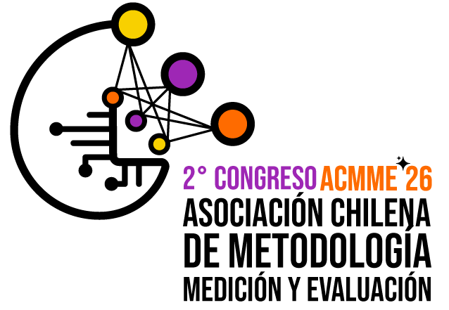
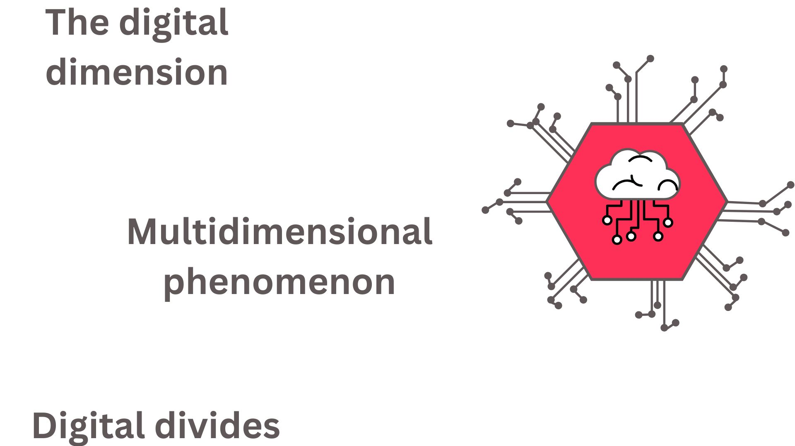
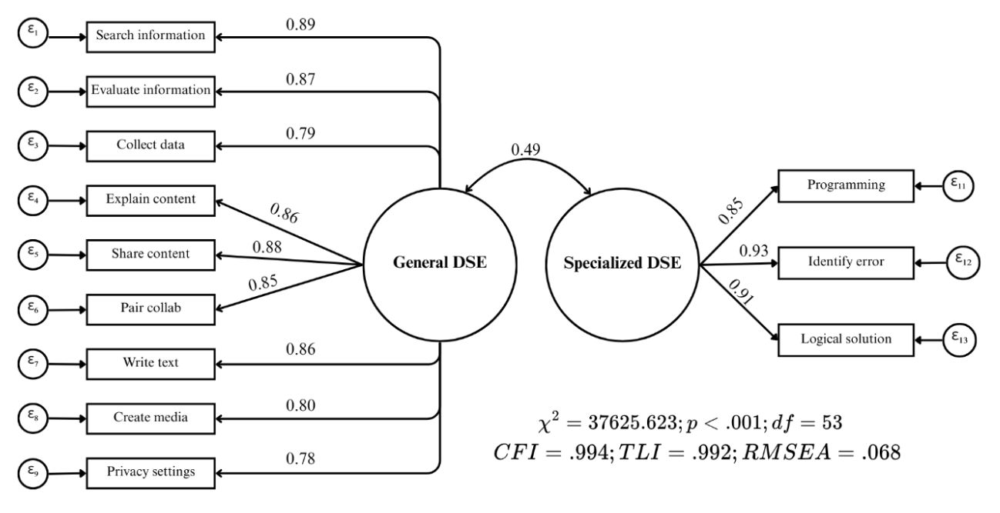
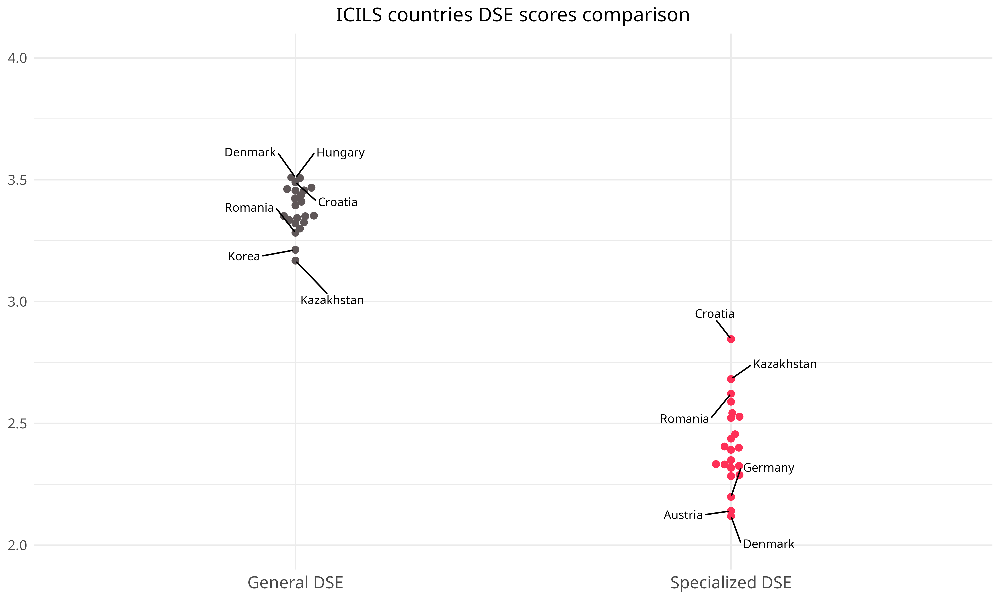
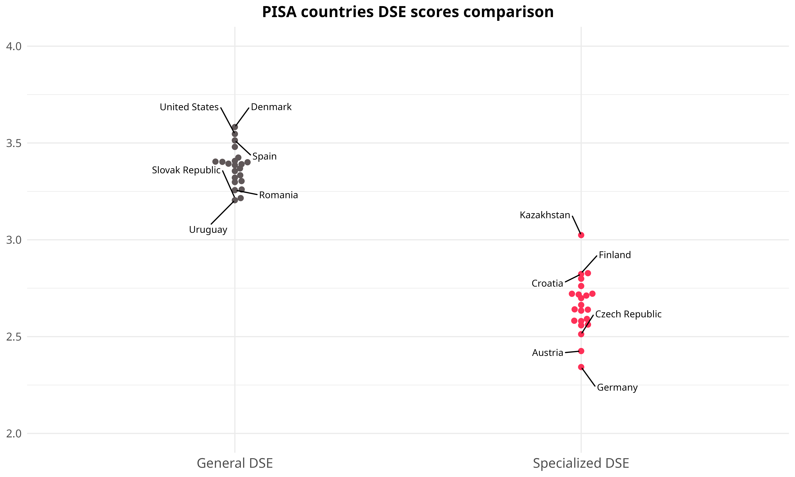

::::: columns
::: {.column width="10%"}





:::

::: {.column .column-right width="85%"}
<br>

### **Midiendo la Autoeficacia Digital en Evaluaciones Internacionales a Gran Escala: Una escala comparativa bidimensional entre ICILS y PISA**

------------------------------------------------------------------------

Daniel Miranda, Ismael Aguayo, Nicolas Tobar, Tomás Urzúa y Juan Carlos Castillo

#### Universidad de Chile y [Núcleo Milenio de Desigualdades y Oportunidades Digitales](https://nudos.cl).

Segundo Congreso Internacional de la Asociación Chilena de Metodología, Medición y Evaluación, La Serena, Chile. 07, 08 y 09 de enero 2026
:::
:::::

## Punto de partida



## Autoeficacia digital

::::: columns
::: {.column width="50%" style="font-size: 40px;"}
"... *expectativas sobre las propias capacidades para aprender y realizar tareas en tecnologías y entornos digitales*, es uno de los componentes principales para promover la formación de competencias digitales" (Ulffert-Blank & Schmidt, 2022).
:::

::: {.column width="50%"}
{width="100%"}
:::
:::::

## ¿Autoeficacia digital bidimensional?

::: {.incremental .highlight-last style="font-size: 35px;"}
-   Un concepto en evolución: Computacional -\> Internet -\> TICs

-   En los últimos años las TIC se han dividido en dos tipos de autoeficacia: general y especializada.

-   Estudios internacionales operacionalizan la autoeficacia digital de manera unidimensional y bidimensional
:::

## Medición de autoeficacia digital

::: {.incremental .highlight-last style="font-size: 30px;"}
- Hay dos principales estudios a nivel internacional que han medido la autoeficacia digital

  - [International Computer and Information Literacy Study (ICILS)](https://www.iea.nl/studies/iea/icils/2023): autoeficacia bidimensional
  
  - [Programme for International Student Assessment (PISA)](https://www.oecd.org/en/about/programmes/pisa.html): autoeficacia unidimensional

- Desafíos para la comparabilidad entre: estudios, países y género
:::

##  {data-background-color="#5f5758"}

::: {style="font-size: 180%; display: flex; justify-content: center; align-items: flex-start; flex-direction: column; text-align: center"}
*¿Es posible establecer un modelo de medición equivalente de autoeficacia digital bidimensional en ICILS y PISA?*

*¿Es el modelo bidimensional de Autoeficacia Digital equivalente por género y entre países?*

*¿Qué diferencias de género existen en la Autoeficacia Digital entre países?*
:::

## Hipótesis

- $H_{1}$: Es posible identificar dos dimensiones latentes de la autoeficacia digital (general y especializada) en PISA 2022 e ICILS 2023.

::: {.incremental .highlight-last style="font-size: 30px;"}
- $H_{2}$: El modelo de medición bidimensional de la autoeficacia digital es equivalente entre países.

- $H_{3}$: El modelo de medición bidimensional de la autoeficacia digital es equivalente entre niñas y niños.

- $H_{4}$: El DSE general y el especializado muestran patrones distintos de asociación con el género y el contexto nacional.
:::

# Método {data-background-color="#5f5758"}

## Participantes

::::: columns
::: {.column width="50%" style="font-size: 40px;"}
-   Estudiantes de 22 países compartidos.

-   ICILS 2023 (n≈91.000).

-   PISA 2022 (n≈183.000).
:::

::: {.column width="50%"}
{width="50%"} {width="70%"}
:::
:::::

## Medidas

**ICILS**: ¿Qué tan bien puedes hacer...?

**PISA**: ¿En qué medida *eres capaz de hacer* las siguientes tareas al usar <fuentes digitales>?

::::: columns
::: {.column width="50%" style="font-size: 30px;"}
**Autoeficacia General**

ICILS: 10 ítems; PISA: 8 ítems

-   Buscar y evaluar información en línea.

-   Compartir contenido en línea.

-   Escribir o editar textos.

-   Crear una presentación multimedia.
:::

::: {.column width="50%" style="font-size: 30px; color: #ff3057;"}
**Autoeficacia Especializada**

ICILS: 3 ítems; PISA: 6 ítems

-   Desarrollo de sitios web.

-   Programación.

-   Razonamiento computacional.
:::
:::::

Más información: [acá](https://milenio-nudos.github.io/picils_dse/output/article/paper.html#the-unidimensional-dse-approach-on-pisa)

## Estrategia analítica

::: {.incremental .highlight-last style="font-size: 40px;"}
-   Análisis factorial confirmatorio y re-especificación

-   Invarianza entre países y por género (CFA multigrupo)

-   Diferencias por país y por género
:::

# Resultados {data-background-color="#5f5758"}

1.  Modelo de medición
2.  Pruebas de invarianza
3.  Distribuciones de medias entre países
4.  Diferencias de género entre países

## Modelo ICILS


## Modelo PISA



## Invarianza ICILS

```{r}
#| label: tbl-invariance-icils
#| tbl-cap: "Invarianza por país y género ICILS"

library(here)
library(flextable)
library(officer)
invariance_icils <- readRDS(here("output", "article", "tables", "invariance_table_icils.rds"))

# Obtener número de filas
n_rows <- nrow(invariance_icils$body$dataset)

invariance_icils |>
  set_table_properties(
    width = 1,        
    layout = "autofit"  
  ) |>
  width(width = dim(invariance_icils)$widths / sum(dim(invariance_icils)$widths)) |>
  height(height = 0.6, part = "header") |>  # altura del encabezado
  height(height = 2, part = "body") |>    # altura de cada fila del cuerpo (ajusta este valor)
  valign(valign = "center", part = "all") |>
  fontsize(size = 14, part = "all")  # aumenta el tamaño de fuente también
```

## Invarianza PISA

```{r}
#| label: tbl-invariance-pisa
#| tbl-cap: "Invarianza por país y género PISA"

invariance_pisa <- readRDS(here("output", "article", "tables", "invariance_table_pisa.rds"))

# Obtener número de filas
n_rows <- nrow(invariance_pisa$body$dataset)

invariance_pisa |>
  set_table_properties(
    width = 1,        
    layout = "autofit"  
  ) |>
  width(width = dim(invariance_pisa)$widths / sum(dim(invariance_pisa)$widths)) |>
  height(height = 0.6, part = "header") |>  # altura del encabezado
  height(height = 2, part = "body") |>    # altura de cada fila del cuerpo (ajusta este valor)
  valign(valign = "center", part = "all") |>
  fontsize(size = 14, part = "all")  # aumenta el tamaño de fuente también

```

## 

{width="100%"}

## 

{width="100%"}

## 

{width="100%"}

## 

{width="100%"}

## Conclusión

::: {.incremental .highlight-last style="font-size: 100%;"}
-   ¿Es posible identificar un modelo bidimensional en ICILS y PISA?

    -   Sí, pero con menos ítems de los propuestos por ambos estudios.

-   ¿El modelo bidimensional de autoeficacia digital es equivalente entre géneros y países?

    -   En PISA, sí; en ICILS, sólo a nivel métrico.

-   ¿Qué diferencias de género existen en la autoeficacia digital entre países?

    -   Las mujeres tienen ventaja en autoeficacia general, mientras que los hombres en autoeficacia especializada.
:::

## Discusión

::: {.highlight-last style="font-size: 50px;"}
-   ¿Hay una, dos o más dimensiones?

-   La relación contraintuitiva entre desarrollo de los países y la brecha de género
:::

## Siguientes pasos {style="font-size: 50px;"}

-   ¿Qué factores a nivel macro pueden explicar las diferencias en autoeficacia digital y la brecha de género?

-   ¿Qué ocurre en países desarrollados/ en desarrollo?

# ¡Gracias!

-   **Repositorio GitHub del proyecto:** <https://github.com/milenio-nudos/picils_dse>

# Anexo

## Ítems eliminados

-   Manipulación multimedia
-   Búsqueda de fuentes de información
-   Configuraciones de privacidad
-   Selección de aplicaciones.