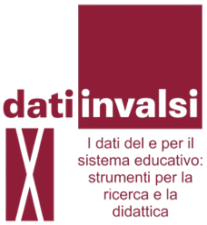
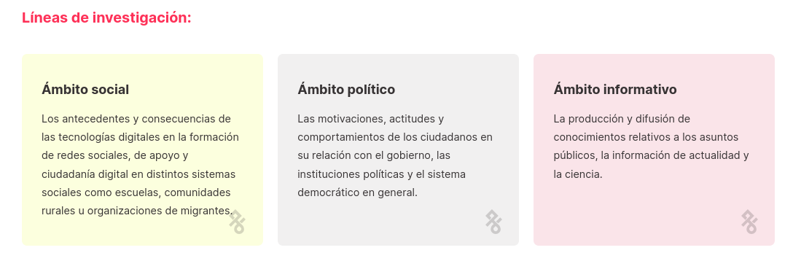
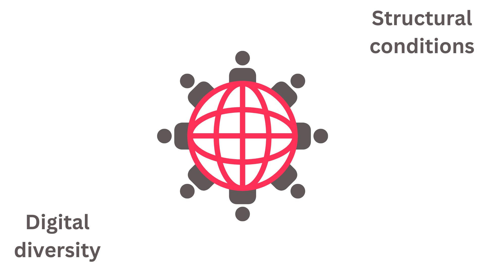
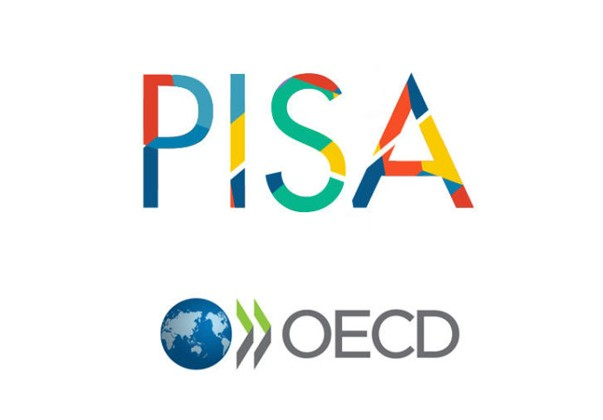
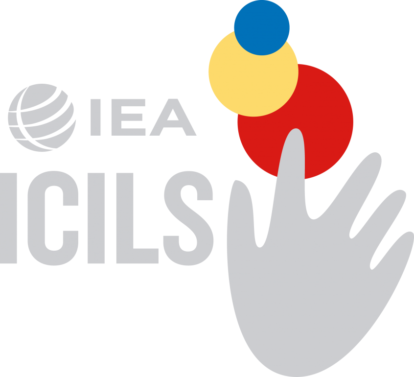

::: columns
::: {.column width="10%"}





:::

::: {.column .column-right width="85%"}
<br>

### **Measuring Digital Self-Efficacy in International Large-Scale Assessments: An International Comparison Between ICILS and PISA**

------------------------------------------------------------------------

Daniel Miranda, Ismael Aguayo, Juan Carlos Castillo, Nicolas Tobar y Tomás Urzúa

#### University of Chile y [Millennium Nucleus on Digital Inequalities and Opportunities](https://nudos.cl).

X Seminar "Data from and for the educational system: tools for research and teaching", Ostia, Rome, 19 - 20 - 21 November 2025
:::
:::

## NUDOS {.scrollable}

```{=html}
<iframe width="1000" height="500" src="https://www.nudos.cl/" title="Webpage example"></iframe>
```
[More information: nudos.cl](https://www.nudos.cl/)

{width="80%" fig-align="center"}



## Starting point


## Digital self-efficacy and gender

::: columns
::: {.column width="50%" style="font-size: 40px;"}
"... *expectations about one's capabilities to learn and accomplish tasks in digital technologies and digital environments*, is one of the principal components to promote the formation of digital competences" (Ulffert-Blank & Schmidt, 2022).
:::

::: {.column width="50%"}
{width="100%"}
:::
:::

## Bidimensional digital self-efficacy?

::: {.incremental .highlight-last style="font-size: 35px;"}

-   A changing concept: Computacional -\> Internet -\> TICs -\> Digital (DigComp)

-   In the last years it has been proposed a distinction between two types of self-efficacy: general and specialized.

-   Cross-country studies operationalize digital self-efficacy in a one-dimensional and two-dimensional manner

:::

## Country differences?




##  {data-background-color="#5f5758"}

::: {style="font-size: 180%; display: flex; justify-content: center; align-items: flex-start; flex-direction: column; text-align: center"}
*It is possible to identify two dimensions on PISA Digital Self-efficacy measurement?*

*Is the bidimensional model of Digital Self-efficacy equivalent by gender and across countries?*

*Which gender differences exist on Digital Self-efficacy across countries?*
:::

## Data

::: columns
::: {.column width="50%" style="font-size: 40px;"}
-   Programme for International Student Assessment 2022 (n≈183.000).

-   International Computer and Information Literacy Study 2023 (n≈90.000).

-   22 shared countries.
:::

::: {.column width="50%"}
{width="70%"} {width="50%"}
:::
:::

## Baterías de Autoeficacia digital

PISA: ¿To what extent *are you able to do* the following tasks when using <digital sources>?

ICILS: How well you can do...?

::: columns
::: {.column width="50%" style="font-size: 30px;"}
**General Self_Efficacy**

PISA: 8 ítems, ICILS: 10 ítems

- Search for and evaluate information online.

- Share content online.

- Write or edit text.

- Create or edit images.
:::

::: {.column width="50%" style="font-size: 30px; color: #ff3057;"}
**Specialized Self-Efficacy**

PISA: 6 ítems, ICILS: 3 ítems

- Website development.

- Programming.

- Computational reasoning.
:::
:::

# Methods {data-background-color="#5f5758"}

-   Conformatory Factor Analizes and re-specification

-   Stability among countries and gender (Multigroup CFA)

-   Country and gender differences

# Results {data-background-color="#5f5758"}

1.  Measurement model
2.  Invariance testing
3.  Mean distributions across countries
4.  Gender differences across countries

## Original model: pooled

#### PISA 2022

CFI = 0.98; TLI = 0.97; RMSEA = 0.15, exceeding the maximum acceptable RMSEA threshold of 0.08

#### ICILS 2023

CFI = 0.97; TLI = 0.96; RMSEA = 0.10, exceeding the maximum acceptable RMSEA threshold of 0.08

## Adjusted Modelo: pooled


## AFC and Invariance

#### Across countries


#### By gender


## 

{width="100%"}

## 

{width="100%"}

## 

{width="100%"}

## 

{width="100%"}

## Conclusion

::: {.incremental .highlight-last style="font-size: 100%;"}
- Is it possible to identify two dimensions in PISA and ICILS?

    - Yes, but with fewer items than those proposed by both studies.

- Is the two-dimensional model of digital self-efficacy equivalent across genders and countries?

    - In PISA, yes; in ICILS, only at the metric level.

- What gender differences exist in digital self-efficacy across countries?

    - Women have an advantage in general self-efficacy, and men in specialized self-efficacy.
:::

## Discussion

::: {.highlight-last style="font-size: 40px;"}
- The evolution of measurements: ICTSE vs. DSE and the DigComp framework

- Are there two or more dimensions?

- The counterintuitive relationship between countries' development and the gender gap
:::

## Next steps {style="font-size: 60px;"}

- What macro-level factors can explain the differences in digital self-efficacy and the gender gap?

- What is happening in developed/developing countries?

# Thank you!

-   **Sitio web NUDOS:** [www.nudos.cl](https://www.nudos.cl/)
-   **Repository Github of the proyect:** <https://github.com/milenio-nudos/picils_dse>

# Anex

## Eliminated items

- Multimedia manipulation
- Searching for information sources
- Privacy settings
- App selection.
